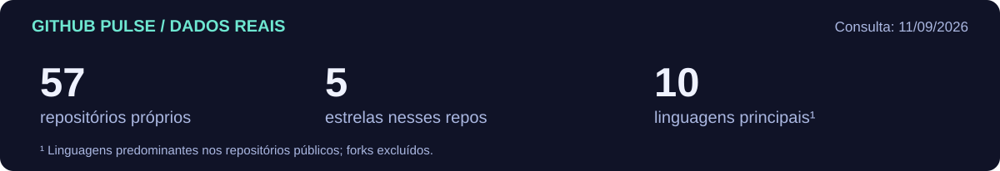

<a href="./GALLERY.md">🎛️ Explorar todos os universos</a> · <a href="https://www.lucasoliveira04.com/">🌐 Portfólio</a> · <a href="https://www.linkedin.com/in/lucas-oliveira-campos/">🤝 LinkedIn</a>

### Um pouco sobre quem está no loop

Sou **Lucas Oliveira**, desenvolvedor Java Backend em **São Paulo**, estudante de Ciência da Computação na **UNINOVE**. Construo APIs com Java e Spring e exploro integrações, mensageria e observabilidade. Nos estudos, vou dos algoritmos em Java à memória em C.

**Meu fio condutor:** entender o que acontece depois que a chamada sai da API.

### 🐍 Cada contribuição deixa um rastro

<picture>
  <source media="(prefers-color-scheme: dark)" srcset="./assets/animado/snake-dark.svg">
  
</picture>

Gerada com o gráfico de contribuições do GitHub pelo [Platane/snk](https://github.com/Platane/snk). O workflow reconstrói a cobra e os dados diariamente.

### 🚀 Projetos para abrir em outra aba

| Projeto | O que estou explorando |
| :--- | :--- |
| [📁 api_share_file](https://github.com/lucasoliveira04/api_share_file) | Compartilhamento de arquivos por links · Java, Spring e AWS S3 |
| [📡 ms-transaction-kafka](https://github.com/lucasoliveira04/ms-transaction-kafka) | Transações e comunicação entre sistemas com Kafka |
| [🔎 user-finance-graphql](https://github.com/lucasoliveira04/user-finance-graphql) | GraphQL e Spring WebFlux em uma API para finanças |
| [🧠 dsa](https://github.com/lucasoliveira04/dsa) | Algoritmos, estruturas e padrões em Java |
| [⚙️ garbage_collector](https://github.com/lucasoliveira04/garbage_collector) | Experimentação com gerenciamento de memória em C |

<b>🧰 Expandir minha caixa de ferramentas</b>

**Backend:** Java, Spring Boot, Spring Security e SQL. 
**Comunicação:** Kafka, RabbitMQ e AWS S3. 
**Ambiente e observação:** Docker, OpenTelemetry, Grafana e Prometheus. 
**Fundamentos em estudo:** C, algoritmos e estruturas de dados.

<b>🧪 Abrir o laboratório de ideias</b>

[DeckIfy](https://github.com/lucasoliveira04/DeckIfy) conecta IA e flashcards para estudar com Anki. [API Process Image](https://github.com/lucasoliveira04/api-process-image) explora processamento de imagens com Python, RabbitMQ e Redis. A curiosidade também aparece fora da stack principal.

### 💚 GitHub Pulse

<!-- LIVE:START -->

| Repositório com push recente | Linguagem | Último push |
| :--- | :--- | :--- |
| [api\_share\_file](https://github.com/lucasoliveira04/api_share_file) | Java | 11/09/2026 |
| [garbage\_collector](https://github.com/lucasoliveira04/garbage_collector) | C | 11/09/2026 |
| [dsa](https://github.com/lucasoliveira04/dsa) | Java | 11/09/2026 |

Consulta em 11/09/2026. Dados públicos; forks excluídos. Push recente não implica conclusão do projeto.
<!-- LIVE:END -->

---

<a href="https://www.lucasoliveira04.com/">Portfólio ↗</a> &nbsp;·&nbsp; <a href="https://www.linkedin.com/in/lucas-oliveira-campos/">LinkedIn ↗</a> &nbsp;·&nbsp; <a href="https://github.com/lucasoliveira04?tab=repositories">Explorar repositórios ↗</a>

