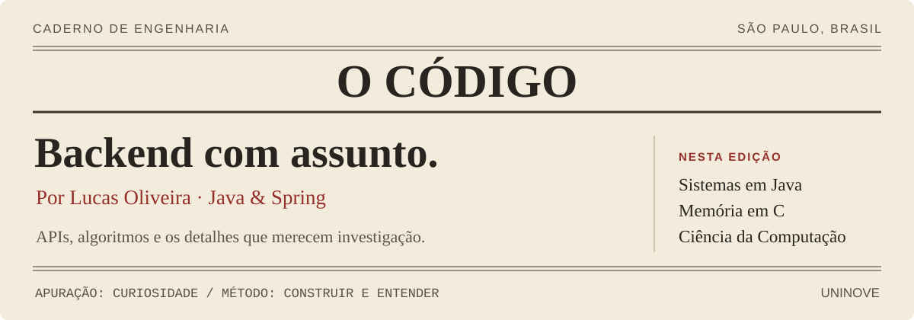
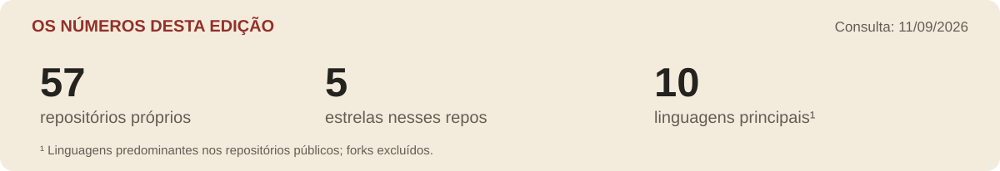

<a href="../../GALLERY.md">Todas as edições ↗</a>

### O desenvolvedor por trás desta edição

**Lucas Oliveira** é desenvolvedor Java Backend em São Paulo e estudante de Ciência da Computação na **UNINOVE**. Este perfil reúne seus projetos de APIs, integrações e mensageria, ao lado de estudos de algoritmos em Java e memória em C.

> Há sempre uma segunda matéria depois do endpoint: entender como a mensagem circula, onde o dado fica e o que o código faz com a memória.

---

### Em pauta / engenharia de backend

**Arquivos ganham uma nova forma de circular** 
[Share File](https://github.com/lucasoliveira04/api_share_file) explora compartilhamento de arquivos por links em uma API com Java, Spring e AWS S3.

**Sistemas também precisam conversar** 
[Transaction Kafka](https://github.com/lucasoliveira04/ms-transaction-kafka) é um microserviço para explorar transações e mensagens com Kafka.

**Uma consulta, outra perspectiva** 
[Finance GraphQL](https://github.com/lucasoliveira04/user-finance-graphql) combina GraphQL e Spring WebFlux em uma API para finanças.

### Caderno de estudos / abaixo da superfície

| Coluna | Leitura |
| :--- | :--- |
| Resolução de problemas | [DSA: estruturas e padrões em Java](https://github.com/lucasoliveira04/dsa) |
| Memória em investigação | [Garbage Collector: experimentação em C](https://github.com/lucasoliveira04/garbage_collector) |
| Aprender com ferramentas | [DeckIfy: IA, flashcards e Anki](https://github.com/lucasoliveira04/DeckIfy) |

<b>Expediente / tecnologias desta publicação</b>

Java, Spring Boot, Spring Security e SQL na base. Kafka, RabbitMQ e AWS S3 nas integrações. Docker, OpenTelemetry, Grafana e Prometheus na caixa de ferramentas. C e algoritmos continuam na pauta de estudos.

### Os números desta edição

<!-- LIVE:START -->

| Repositório com push recente | Linguagem | Último push |
| :--- | :--- | :--- |
| [api\_share\_file](https://github.com/lucasoliveira04/api_share_file) | Java | 11/09/2026 |
| [garbage\_collector](https://github.com/lucasoliveira04/garbage_collector) | C | 11/09/2026 |
| [dsa](https://github.com/lucasoliveira04/dsa) | Java | 11/09/2026 |

Consulta em 11/09/2026. Dados públicos; forks excluídos. Push recente não implica conclusão do projeto.
<!-- LIVE:END -->

---

**Fale com o autor:** [Portfólio](https://www.lucasoliveira04.com/) · [LinkedIn](https://www.linkedin.com/in/lucas-oliveira-campos/) · [Arquivo completo de projetos](https://github.com/lucasoliveira04?tab=repositories)

Edição aberta. A próxima descoberta pode render uma nova página.
