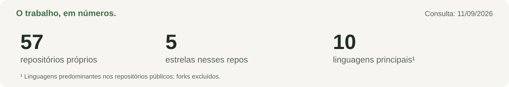

<a href="../../GALLERY.md">dez formas de ver este perfil ↗</a>

**Sou Lucas Oliveira.** Desenvolvedor Java Backend em São Paulo, estudante de Ciência da Computação na UNINOVE.

Construo APIs com Java e Spring. Gosto de atravessar as abstrações: entender a mensagem que saiu, o dado que voltou e a memória que ficou. Por aqui, projetos de backend convivem com algoritmos em Java e experimentos em C.

[Portfólio ↗](https://www.lucasoliveira04.com/) &nbsp; / &nbsp; [LinkedIn ↗](https://www.linkedin.com/in/lucas-oliveira-campos/)

---

### 01 — Construir

[**Share File**](https://github.com/lucasoliveira04/api_share_file) 
Arquivos que viram links. API com Java, Spring e AWS S3.

[**Transaction Kafka**](https://github.com/lucasoliveira04/ms-transaction-kafka) 
Transações, mensagens e a conversa entre sistemas.

[**Finance GraphQL**](https://github.com/lucasoliveira04/user-finance-graphql) 
GraphQL e Spring WebFlux em uma API para finanças.

### 02 — Entender

[**DSA**](https://github.com/lucasoliveira04/dsa) — padrões, estruturas e problemas resolvidos em Java. 
[**Garbage Collector**](https://github.com/lucasoliveira04/garbage_collector) — um mergulho em gerenciamento de memória com C. 
[**DeckIfy**](https://github.com/lucasoliveira04/DeckIfy) — IA e flashcards para apoiar o próximo aprendizado.

### 03 — Conectar

`Java` · `Spring` · `SQL` · `Kafka` · `RabbitMQ` · `AWS S3` · `Docker`

Um pouco além da stack

Também exploro OpenTelemetry, Grafana e Prometheus para observar sistemas. Meu fio condutor é entender o comportamento do código: do contrato de uma API até os detalhes de uma estrutura de dados.

### 04 — Continuar

<!-- LIVE:START -->

| Repositório com push recente | Linguagem | Último push |
| :--- | :--- | :--- |
| [api\_share\_file](https://github.com/lucasoliveira04/api_share_file) | Java | 11/09/2026 |
| [garbage\_collector](https://github.com/lucasoliveira04/garbage_collector) | C | 11/09/2026 |
| [dsa](https://github.com/lucasoliveira04/dsa) | Java | 11/09/2026 |

Consulta em 11/09/2026. Dados públicos; forks excluídos. Push recente não implica conclusão do projeto.
<!-- LIVE:END -->

---

Menos ruído. Mais coisas que fazem sentido. &nbsp; [Explorar todos os repositórios →](https://github.com/lucasoliveira04?tab=repositories)
