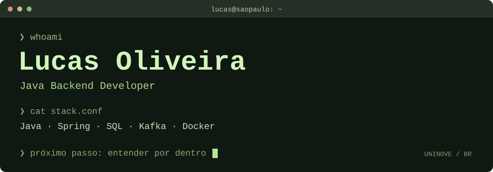
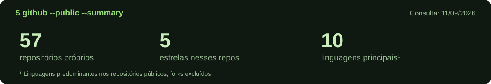

<p align="right"><a href="../../GALLERY.md">cd ../temas →</a></p>



### `~/lucas` $ whoami

Sou **Lucas Oliveira**, desenvolvedor Java Backend em São Paulo e estudante de Ciência da Computação na **UNINOVE**. Construo APIs com Java e Spring e estudo os fundamentos por trás do código: algoritmos, estruturas de dados e memória em C.

```sh
$ cat interesses.txt
APIs e integração entre sistemas
Mensageria e observabilidade
Algoritmos em Java
Gerenciamento de memória em C
```

### `~/projects` $ ls

| Diretório | Conteúdo |
| :--- | :--- |
| [api_share_file/](https://github.com/lucasoliveira04/api_share_file) | Compartilhamento de arquivos por links · Java, Spring e AWS S3 |
| [ms-transaction-kafka/](https://github.com/lucasoliveira04/ms-transaction-kafka) | Transações e mensageria com Kafka |
| [user-finance-graphql/](https://github.com/lucasoliveira04/user-finance-graphql) | GraphQL e Spring WebFlux em uma API para finanças |
| [dsa/](https://github.com/lucasoliveira04/dsa) | Estruturas, algoritmos e padrões de resolução em Java |
| [garbage_collector/](https://github.com/lucasoliveira04/garbage_collector) | Experimentos com memória em C |

### `~/config` $ cat stack.conf

```ini
backend = Java, Spring Boot, Spring Security, SQL
integration = Kafka, RabbitMQ, AWS S3
tooling = Docker, OpenTelemetry, Grafana, Prometheus
learning = C, algoritmos, estruturas de dados
```

<details>
<summary><code>$ find ./projects -name '*curiosidade*'</code></summary>

[DeckIfy](https://github.com/lucasoliveira04/DeckIfy) une IA e flashcards para exportar material de estudo ao Anki. Também há [processamento de imagens com Python, RabbitMQ e Redis](https://github.com/lucasoliveira04/api-process-image) e [estudos de SOLID em Java](https://github.com/lucasoliveira04/solid-principles-java).

</details>

### `~/git` $ status --public

<!-- LIVE:START -->


| Repositório com push recente | Linguagem | Último push |
| :--- | :--- | :--- |
| [api\_share\_file](https://github.com/lucasoliveira04/api_share_file) | Java | 11/09/2026 |
| [garbage\_collector](https://github.com/lucasoliveira04/garbage_collector) | C | 11/09/2026 |
| [dsa](https://github.com/lucasoliveira04/dsa) | Java | 11/09/2026 |

<sub>Consulta em 11/09/2026. Dados públicos; forks excluídos. Push recente não implica conclusão do projeto.</sub>
<!-- LIVE:END -->

---

`$ open` [portfólio](https://www.lucasoliveira04.com/) · [LinkedIn](https://www.linkedin.com/in/lucas-oliveira-campos/) · [repositórios](https://github.com/lucasoliveira04?tab=repositories)

<sub>A próxima pergunta costuma começar com “mas como isso funciona?”.</sub>
